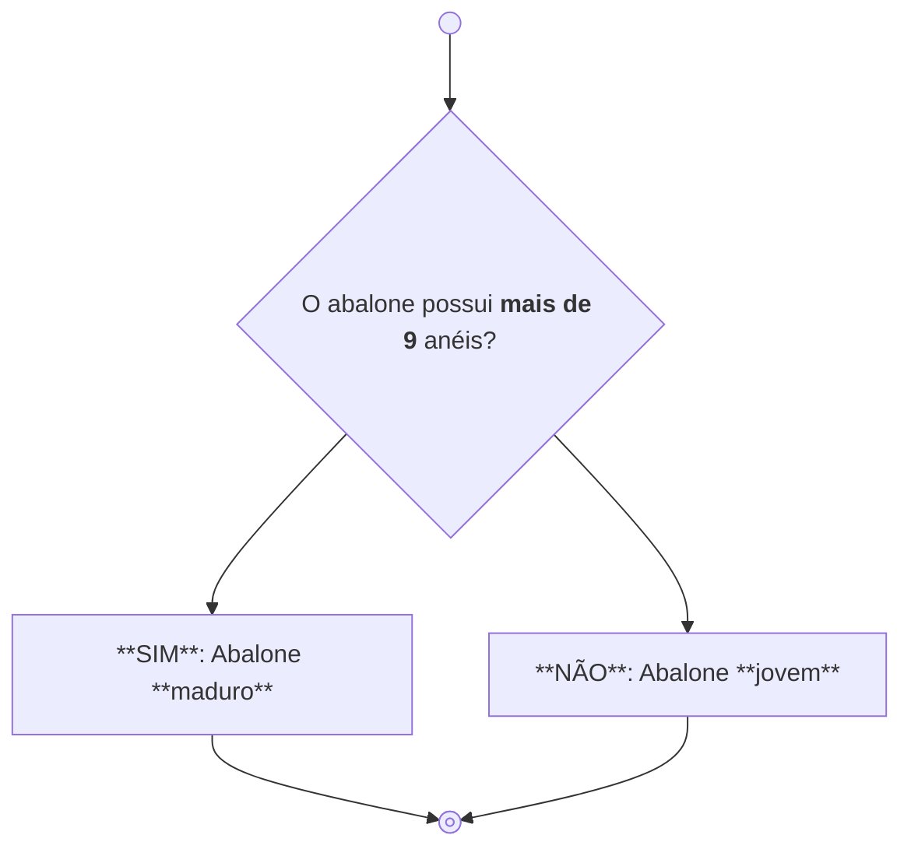

# :shell: Abalone - Uma comparação entre modelos de Machine Learning de classificação binária

:white_check_mark: **RESULTADO:** 
Obtido <b>81.91% de acerto</b>  entre os abalones identificados como maduros ao aplicar o modelo SVC com todas as informações disponíveis.

 

### Sobre os Dados
O dataset utilizado foi ["Abalone Data Set"](https://archive.ics.uci.edu/ml/datasets/abalone). Esses dados foram originalmente obtidos do artigo científico:
> Warwick J Nash, Tracy L Sellers, Simon R Talbot, Andrew J Cawthorn and Wes B Ford (1994)
**"The Population Biology of Abalone (_Haliotis_ species) in Tasmania. I. Blacklip Abalone (_H. rubra_) from the North Coast and Islands of Bass Strait"**,
Sea Fisheries Division, Technical Report No. 48 (ISSN 1034-3288)
 

### Business comprehension
Em 2022 a [União Internacional para a Conservação da Natureza (IUCN)](https://iucn.org/press-release/202212/human-activity-devastating-marine-species-mammals-corals-iucn-red-list) realizou a primeira avaliação global das espécies de abalone, revelando que **20 das 54 espécies conhecidas estão ameaçadas de extinção**. A pesca excessiva, tanto legal quanto ilegal, é um fator determinante no declínio das populações de abalone em todo o mundo.

Nessa análise, foi feita a suposição de que a correta identificação entre um abalone jovem (<= 9 anéis) ou maduro (> 9 anéis) seria essencial para o negócio em questão, sendo desejada apenas a captura dos abalones maduros. Uma incorreta captura de abalones jovens poderia afetar negativamente o rendimento das caputura em um ano posterior, devido a uma diminuição da população na área.

